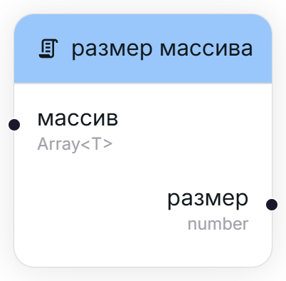

## Пройтись по каждому элементу массива [#array-foreach]

<Wrapper>
    
</Wrapper>

Последовательно проходит по каждому элементу массива. Например, если передать массив `[1, 2, 3]`, узел будет вызван три раза с выходным параметром `1`, `2` и `3`.

<TypeTable type={{
    "массив": {
        required: true,
        type: "Array<T>",
        description: "Массив, по которому требуется пройти.",
        typeDescription: "Массив, содержащий элементы любого типа.",
        io: "input"
    },
    "объект": {
        required: true,
        type: "T",
        description: "Текущий элемент.",
        typeDescription: "Динамичексий тип (зависит от переданного массива)",
        typeDescriptionLink: "/user/nodes/introduction#types",
        io: "output"
    }
}}/>

## Размер массива

<Wrapper>
    
</Wrapper>

Вычисляет размер переданного массива.

<TypeTable type={{
    "массив": {
        required: true,
        type: "Array<T>",
        description: "Массив, размер которого необходимо узнать.",
        typeDescription: "Массив, содержащий элементы любого типа.",
        io: "input"
    },
    "размер": {
        required: true,
        type: "number",
        io: "output",
        description: "Размер переданного массива."
    }
}}/>