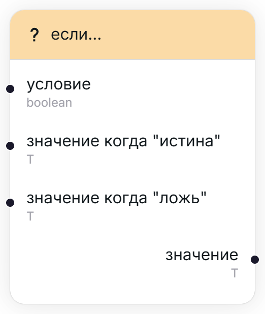

## Если... [#if]

<Wrapper>
    
</Wrapper>

Возвращает одно из двух возможных значений, в зависимости от значения переданного условия (флага).

<TypeTable type={{
    "условие": {
        required: true,
        type: "boolean",
        description: "Флаг, определяющий, какое из значений стоит вернуть.",
        io: "input"
    },
    "значение когда \"истина\"": {
        required: true,
        type: "T",
        description: "Значение, которое будет возвращено, если флаг имеет значение \"истина\".",
        typeDescription: "Динамичексий тип.",
        io: "input"
    },
    "значение когда \"ложь\"": {
        required: true,
        type: "T",
        description: "Значение, которое будет возвращено, если флаг имеет значение \"ложь\".",
        typeDescription: "Динамичексий тип.",
        io: "input"
    },
    "значение": {
        required: true,
        type: "T",
        description: "Результат.",
        typeDescription: "Динамичексий тип (зависит от переданных на вход значений)",
        io: "output"
    },
}}/>

## Повторить Х раз... [#repeat]

<Wrapper>
    
</Wrapper>

Узел-итератор, позволяющий повторить одно и то же действие заданное количество раз. Например, несколько раз вывести уведомление.

<TypeTable type={{
    "кол-во раз": {
        required: true,
        type: "number",
        description: "Количество повторений, которых стоит выполнить.",
        io: "input"
    },
    "итерация": {
        required: true,
        type: "number",
        description: "Номер текущего повторения/цикла (начиная с 1)",
        io: "output"
    },
}}/>

## Пропустить итерацию, если... [#skip-iteration-if]

<Wrapper>
    
</Wrapper>

Пропускает текущую итерацию, если условие имеет значение "истина". Этот узел полезен для фильтрации нужных данных, например, для выборки нужных студентов по некоторому критерию.

<TypeTable type={{
    "условие": {
        required: true,
        type: "boolean",
        description: "Флаг, определяющий, стоит ли пропустить текущую итерацию.",
        io: "input"
    },
    "объект": {
        required: true,
        type: "T",
        description: "Объект, по которому судится критерий выборки (желательно, связанный с интересующим узлом-итератором)",
        typeDescription: "Динамический тип.",
        io: "input"
    },
    "тот же объект": {
        required: true,
        type: "T",
        typeDescription: "Динамический тип.",
        io: "output"
    },
}}/>

<Callout title='Что за "объект"?'>Из-за внутреннего строения движка impoexpo, предпочитается использовать узлы, которые принимают что-то на вход, и выдают что-то на выходе.  Узлы, принимающие входные параметры, но ничего не возвращающие, считаются "завершающими" и имеют приоритет над другими узлами, так как считается, что на них заканчивается выполнение переноса данных (например, узел уведомлений, или большинства интеграций).  Поэтому, чтобы не нарушить этот баланс, данный узел принимает некий объект, желательно связанный с выборкой (т.е. от которого определяется поле "условие"), и возвращает его же.</Callout>

## Выдать ошибку если null [#throw-error-if-null]

<Wrapper>
    
</Wrapper>

Выдаёт ошибку и прекращает перенос данных если переданный объект не имеет значения (null). Иначе, возвращает значение этого же объекта. 

Это возможно, например, при попытке [превратить строку в число](/user/nodes/strings#string-to-number) (при неверном формате строки)

<TypeTable type={{
    "nullable объект": {
        required: true,
        type: "T | null",
        typeDescription: "Объект любого типа, с вероятностью, что он не имеет значения.",
        description: "Объект, который необходимо проверить.",
        io: "input"
    },
    "сообщение об ошибке": {
        required: true,
        type: "string",
        description: "Сообщение, которое стоит вывести, если объект не имеет значения.",
        io: "input"
    },
    "объект": {
        required: true,
        type: "T",
        typeDescription: "Динамический тип (зависит от переданного на вход объекта)",
        description: "Тот же объект, но с гарантией, что он имеет значение.",
        io: "output"
    }
}}/>