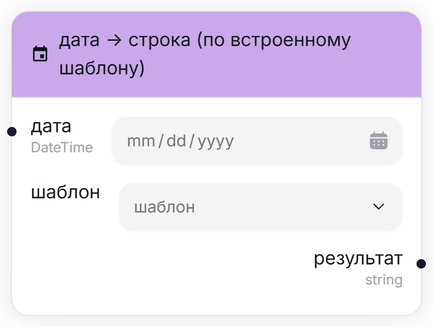
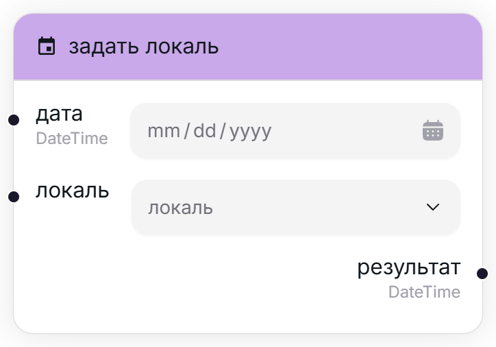
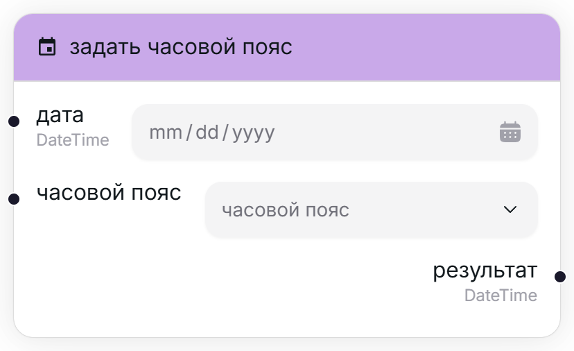

## Текущая дата [#current]

<Wrapper>
    
</Wrapper>

Возвращает сегодняшнюю дату.

<Callout type="warning">Учтите, что дата определяется во время выполнения переноса, т.е. если вы создали проект 1 января, а запустили 5 января, то узер вернёт "5 января".</Callout>

<TypeTable type={{
    "результат": {
        required: true,
        type: "DateTime",
        description: "Текущая дата.",
        io: "output"
    },
}}/>

## Находится ли дата в диапозоне? [#date-in-range]

<Wrapper>
    
</Wrapper>

Возвращает флаг, указывающий, принадлежит ли некая дата заданному диапозону.

<Callout type="warning">Проверка производится **включая** начальные и конечные даты.</Callout>

<TypeTable type={{
    "дата": {
        required: true,
        type: "DateTime",
        description: "Дата, над которой проводится проверка.",
        io: "input"
    },
    "начало": {
        required: true,
        type: "DateTime",
        description: "Самая ранняя допустимая дата в диапазоне.",
        io: "input"
    },
    "конец": {
        required: true,
        type: "DateTime",
        description: "Самая поздняя допустимая дата в диапазоне.",
        io: "input"
    },
    "результат": {
        required: true,
        type: "boolean",
        description: "Флаг, указывающий, находится ли дата в диапозоне.",
        io: "output"
    },
}}/>

## Дата -> строка (по встроенному шаблону) [#format-auto]

<Wrapper>
    
</Wrapper>

Форматирует дату в строку по заданному шаблону.

<TypeTable type={{
    "дата": {
        required: true,
        type: "DateTime",
        description: "Дата, которую стоит отформатировать в строку.",
        io: "input"
    },
    "шаблон": {
        required: true,
        io: "input"
    },
    "результат": {
        required: true,
        type: "string",
        description: "Отформатированная дата.",
        io: "output"
    }
}}/>

## Группировать по дате [#group-by]

<Wrapper>
    
</Wrapper>

Группирует некоторые элементы в [словарь](/user/nodes/introduction#types) по дате.

<TypeTable type={{
    "дата": {
        required: true,
        type: "DateTime",
        description: "Дата, по которой происходит группировка (\"ключ\")",
        io: "input"
    },
    "метод сортировки": {
        required: true,
        type: "по возрастанию (от ранней к поздней дате) / по убыванию (от поздней к ранней дате)",
        description: "Определяет, в каком порядке должны идти элементы в группе.",
        default: "по возрастанию",
        io: "input",
    },
    "ключ": {
        required: true,
        type: "TKey (динамический тип)",
        description: "Настоящий ключ в группировке.",
        io: 'input'
    },
    "значение": {
        required: true,
        type: "TValue (динамический тип)",
        description: "Значение, соответствующее ключу.",
        io: 'input'
    },
    "результат": {
        required: true,
        type: "Dictionary<TKey, Array<TValue>>",
        typeDescription: "Словарь, сгруппированный по ключу, содержащий один или несколько элементов в каждой группе.",
        io: "output"
    }
}}/>

## Задать локаль [#set-locale]

<Wrapper>
    
</Wrapper>

Задаёт локаль для даты.

<Callout title="Что за локаль?">
Разные страны оформляют даты по разному. Самым известным примером является положение месяца и дня в Америке (ММ/ДД/ГГГГ) и в остальных странах (ДД/ММ/ГГГГ). Локали описывают данные языковые и культурные различия.
</Callout>

<TypeTable type={{
    "дата": {
        required: true,
        type: "DateTime",
        description: "Дата, которой стоит поменять локаль.",
        io: "input"
    },
    "локаль": {
        required: true,
        io: "input"
    },
    "результат": {
        required: true,
        type: "DateTime",
        description: "Та же дата, но уже в новом формате.",
        io: "output"
    },
}}/>

## Задать часовой пояс [#set-timezone]

<Wrapper>
    
</Wrapper>

Задаёт часовой пояс для даты.

<Callout title="Для чего это?">
    Сервер, обрабатывающий переносы, находится в одной локации, а вы в другой. Чтобы не возникало конфликтов при фильтрации необходимых данных рекомендуется указывать часовой пояс используемых дат.
</Callout>

<TypeTable type={{
    "дата": {
        required: true,
        type: "DateTime",
        description: "Дата, которой стоит поменять локаль.",
        io: "input"
    },
    "локаль": {
        required: true,
        io: "input"
    },
    "результат": {
        required: true,
        type: "DateTime",
        description: "Та же дата, но уже в новом часовом поясе.",
        io: "output"
    },
}}/>