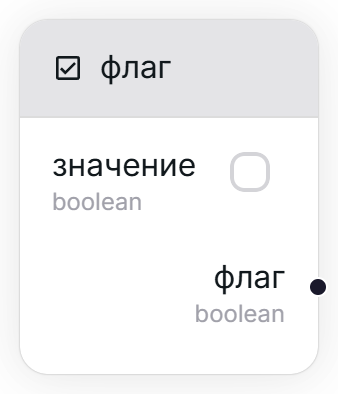
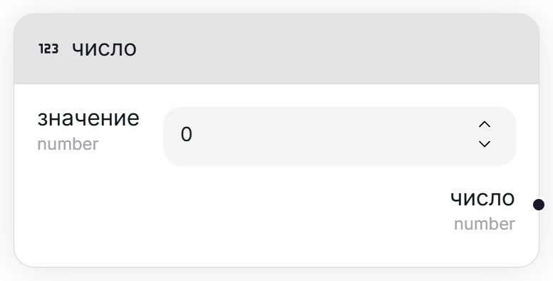

## Флаг [#boolean]

<Wrapper>
    
</Wrapper>

Создаёт новый флаг-литерал.

<TypeTable type={{
    "значение": {
        required: true,
        type: "boolean",
        io: "input",
        default: "ложь (false)"
    },
    "флаг": {
        required: true,
        type: "boolean",
        io: "output"
    }
}}/>

## Дата [#date-time]

<Wrapper>
    
</Wrapper>

Создаёт новую дату-литерал.

<TypeTable type={{
    "значение": {
        required: true,
        type: "DateTime",
        io: "input"
    },
    "дата": {
        required: true,
        type: "DateTime",
        io: "output"
    }
}}/>

## Число [#number]

<Wrapper>
    
</Wrapper>

Создаёт новое число-литерал.

<TypeTable type={{
    "значение": {
        required: true,
        type: "number",
        io: "input",
        default: "0"
    },
    "число": {
        required: true,
        type: "number",
        io: "output"
    }
}}/>

## Строка [#string]

<Wrapper>
    
</Wrapper>

Создаёт новую строку-литерал.

<TypeTable type={{
    "значение": {
        required: true,
        type: "string",
        io: "input",
        default: "\"\" (пустая строка)"
    },
    "строка": {
        required: true,
        type: "string",
        io: "output"
    }
}}/>