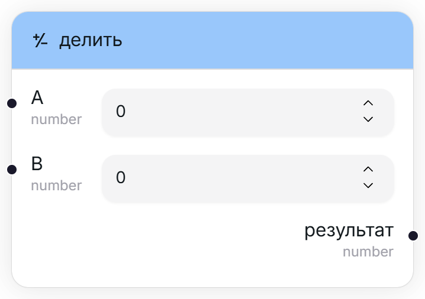
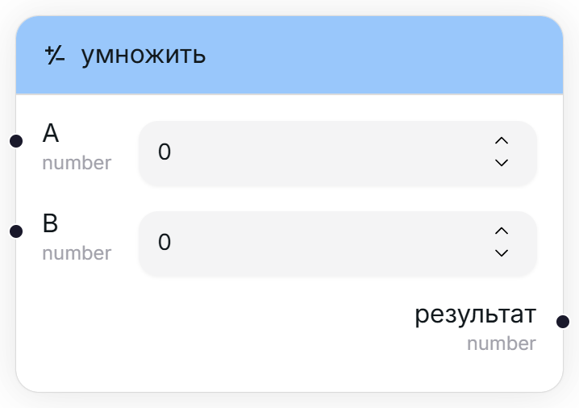

## Модуль (|x|) [#abs]

<Wrapper>
    
</Wrapper>

Берёт число по модулю. Например, `abs(-5) = 5`, `abs(3) = 3`.

<TypeTable type={{
    "ввод": {
        required: true,
        type: "number",
        io: "input",
        default: "0"
    },
    "результат": {
        required: true,
        type: "number",
        description: "Это же число, но по модулю.",
        io: "output"
    }
}}/>

## Сложить (x + y) [#add]

<Wrapper>
    
</Wrapper>

Складывает два числа.

<TypeTable type={{
    "A": {
        required: true,
        type: "number",
        io: "input",
        description: "Первое слагаемое.",
        default: "0"
    },
    "B": {
        required: true,
        type: "number",
        io: "input",
        description: "Второе слагаемое.",
        default: "0"
    },
    "результат": {
        required: true,
        type: "number",
        description: "Результат суммы двух чисел.",
        io: "output"
    }
}}/>

## Делить (x / y) [#divide]

<Wrapper>
    
</Wrapper>

Делит два числа.

<TypeTable type={{
    "A": {
        required: true,
        type: "number",
        io: "input",
        description: "Числитель.",
        default: "0"
    },
    "B": {
        required: true,
        type: "number",
        io: "input",
        description: "Знаменатель.",
        default: "0"
    },
    "результат": {
        required: true,
        type: "number",
        description: "Результат деления двух чисел.",
        io: "output"
    }
}}/>

<Callout type="warning">
    Не делите на ноль, пожалуйста. Движок impoexpo вернёт вам бесконечность. Вам это не надо.
</Callout>

## Логарифм (ln x) [#log]

<Wrapper>
    
</Wrapper>

Считает натуральный логарифм числа (ln).

<TypeTable type={{
    "ввод": {
        required: true,
        type: "number",
        io: "input",
        default: "0"
    },
    "результат": {
        required: true,
        type: "number",
        description: "ln(ввод)",
        io: "output"
    }
}}/>

## Остаток от деления (x % y) [#modulo]

<Wrapper>
    
</Wrapper>

Считает остаток от деления одного числа на другое.

<TypeTable type={{
    "A": {
        required: true,
        type: "number",
        io: "input",
        description: "Делимое.",
        default: "0"
    },
    "B": {
        required: true,
        type: "number",
        io: "input",
        description: "Делитель.",
        default: "0"
    },
    "результат": {
        required: true,
        type: "number",
        description: "Остаток от деления чисел.",
        io: "output"
    }
}}/>

## Умножить (x * y) [#multiply]

<Wrapper>
    
</Wrapper>

Перемножает два числа.

<TypeTable type={{
    "A": {
        required: true,
        type: "number",
        io: "input",
        description: "Первый множитель.",
        default: "0"
    },
    "B": {
        required: true,
        type: "number",
        io: "input",
        description: "Второй множитель.",
        default: "0"
    },
    "результат": {
        required: true,
        type: "number",
        description: "Результат умножения двух чисел.",
        io: "output"
    }
}}/>

## Отрицание (-x) [#negate]

<Wrapper>
    
</Wrapper>

Меняет знак числа на противоположный.

<TypeTable type={{
    "ввод": {
        required: true,
        type: "number",
        io: "input",
        default: "0"
    },
    "результат": {
        required: true,
        type: "number",
        description: "Это же число, но с противоположным знаком.",
        io: "output"
    }
}}/>

## Возвести в степень (x ^ y) [#power]

<Wrapper>
    
</Wrapper>

Возводит число в степень.

<TypeTable type={{
    "A": {
        required: true,
        type: "number",
        io: "input",
        description: "Число, которое следует возвести в некую степень.",
        default: "0"
    },
    "B": {
        required: true,
        type: "number",
        io: "input",
        description: "Степень, в которую требуется возвести число.",
        default: "0"
    },
    "результат": {
        required: true,
        type: "number",
        description: "Результат возведения числа в степень.",
        io: "output"
    }
}}/>

## Вычесть (x - y) [#subtract]

<Wrapper>
    
</Wrapper>

Вычитает одно число из другого.

<TypeTable type={{
    "A": {
        required: true,
        type: "number",
        io: "input",
        description: "Уменьшаемое.",
        default: "0"
    },
    "B": {
        required: true,
        type: "number",
        io: "input",
        description: "Вычитаемое.",
        default: "0"
    },
    "результат": {
        required: true,
        type: "number",
        description: "Результат разности двух чисел.",
        io: "output"
    }
}}/>

## Является ли число целым? [#is-integer]

<Wrapper>
    
</Wrapper>

Возвращает флаг, указывающий, является ли число целым (а не дробью).

<TypeTable type={{
    "число": {
        required: true,
        type: "number",
        io: "input",
        description: "Проверяемое число.",
        default: "0"
    },
    "результат": {
        required: true,
        type: "boolean",
        io: "output"
    }
}}/>