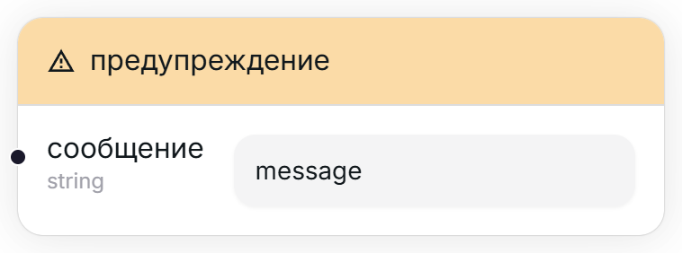

## Ошибка [#error]

<Wrapper>
    
</Wrapper>

Выдаёт ошибку пользователю и прерывает перенос данных.

<TypeTable type={{
    "сообщение": {
        required: true,
        type: "string",
        io: "input",
        description: "Сообщение, которое увидит пользователь.",
    },
}}/>

## Предупреждение [#warning]

<Wrapper>
    
</Wrapper>

Выдаёт предупреждение пользователю, не прерывая при этом перенос данных. Стоит использовать для некритических сбоев, несильно влияющих на перенос данных.

<TypeTable type={{
    "сообщение": {
        required: true,
        type: "string",
        io: "input",
        description: "Сообщение, которое увидит пользователь.",
    },
}}/>

## Информация [#information]

<Wrapper>
    
</Wrapper>

Выдаёт сообщение пользователю. Полезно для отладки проекта или просто информационных сообщений.

<TypeTable type={{
    "сообщение": {
        required: true,
        type: "string",
        io: "input",
        description: "Сообщение, которое увидит пользователь.",
    },
}}/>