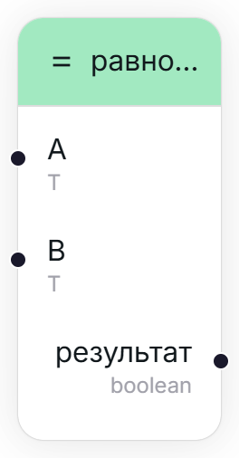
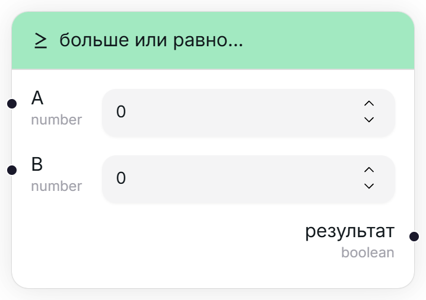
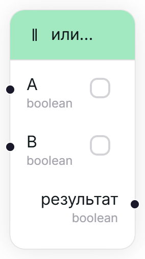

## И... (x && y) [#and]

<Wrapper>
    
</Wrapper>

Логическое И — возвращает флаг, указывающий, имеют ли оба переданных флага значение "истина", т.е. "выполнено ли и то, и то?"

<TypeTable type={{
    "A": {
        required: true,
        type: "boolean",
        io: "input",
        default: "ложь (false)"
    },
    "B": {
        required: true,
        type: "boolean",
        io: "input",
        default: "ложь (false)"
    },
    "результат": {
        required: true,
        type: "boolean",
        description: "A && B",
        io: "output"
    }
}}/>

## Равно... (==) [#equal]

<Wrapper>
    
</Wrapper>

Возвращает флаг, указывающий, равны ли два переданных объекта между собой.

<TypeTable type={{
    "A": {
        required: true,
        type: "T (динамический тип)",
        io: "input",
    },
    "B": {
        required: true,
        type: "T (динамический тип)",
        io: "input",
    },
    "результат": {
        required: true,
        type: "boolean",
        description: "A == B",
        io: "output"
    }
}}/>

## Больше или равно... (>=) [#greater-or-eq]

<Wrapper>
    
</Wrapper>

Возвращает флаг, указывающий, является ли число больше или равно другого.

<TypeTable type={{
    "A": {
        required: true,
        type: "number",
        io: "input",
        default: "0"
    },
    "B": {
        required: true,
        type: "number",
        io: "input",
        default: "0"
    },
    "результат": {
        required: true,
        type: "boolean",
        description: "A >= B",
        io: "output"
    }
}}/>

## Больше чем... (>=) [#greater-than]

<Wrapper>
    
</Wrapper>

Возвращает флаг, указывающий, является ли число **строго** больше другого.

<TypeTable type={{
    "A": {
        required: true,
        type: "number",
        io: "input",
        default: "0"
    },
    "B": {
        required: true,
        type: "number",
        io: "input",
        default: "0"
    },
    "результат": {
        required: true,
        type: "boolean",
        description: "A > B",
        io: "output"
    }
}}/>

## Меньше или равно... (>=) [#less-or-eq]

<Wrapper>
    
</Wrapper>

Возвращает флаг, указывающий, является ли число меньше или равно другого.

<TypeTable type={{
    "A": {
        required: true,
        type: "number",
        io: "input",
        default: "0"
    },
    "B": {
        required: true,
        type: "number",
        io: "input",
        default: "0"
    },
    "результат": {
        required: true,
        type: "boolean",
        description: "A <= B",
        io: "output"
    }
}}/>

## Меньше чем... (>=) [#less-than]

<Wrapper>
    
</Wrapper>

Возвращает флаг, указывающий, является ли число **строго** меньше другого.

<TypeTable type={{
    "A": {
        required: true,
        type: "number",
        io: "input",
        default: "0"
    },
    "B": {
        required: true,
        type: "number",
        io: "input",
        default: "0"
    },
    "результат": {
        required: true,
        type: "boolean",
        description: "A < B",
        io: "output"
    }
}}/>

## Не... (!x) [#not]

<Wrapper>
    
</Wrapper>

Меняет значение флага на противоположное. "Истина" (true) становится "ложью" (false), и наоборот.

<TypeTable type={{
    "ввод": {
        required: true,
        type: "boolean",
        io: "input",
        default: "ложь (false)"
    },
    "результат": {
        required: true,
        type: "boolean",
        description: "!ввод",
        io: "output"
    }
}}/>

## Или... (x || y) [#or]

<Wrapper>
    
</Wrapper>

Логическое ИЛИ — возвращает флаг, указывающий, имеет ли один из переданных флагов значение "истина", т.е. "выполнено ли одно из условий?"

<TypeTable type={{
    "A": {
        required: true,
        type: "boolean",
        io: "input",
        default: "ложь (false)"
    },
    "B": {
        required: true,
        type: "boolean",
        io: "input",
        default: "ложь (false)"
    },
    "результат": {
        required: true,
        type: "boolean",
        description: "A || B",
        io: "output"
    }
}}/>