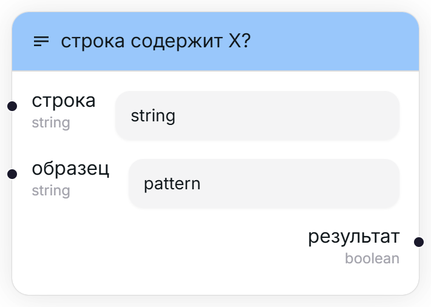
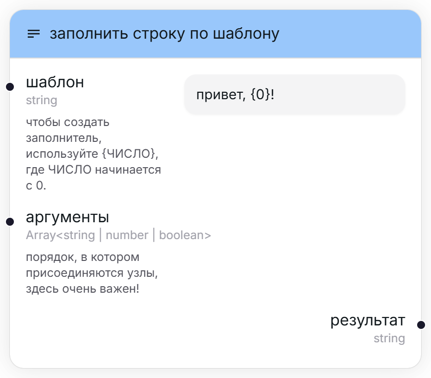
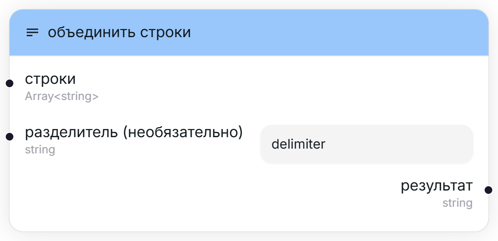
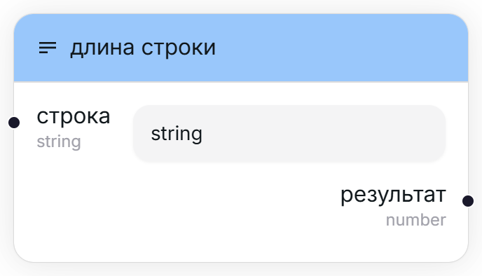
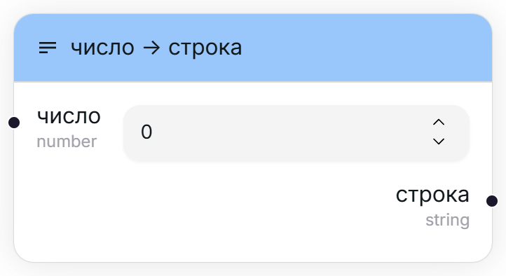
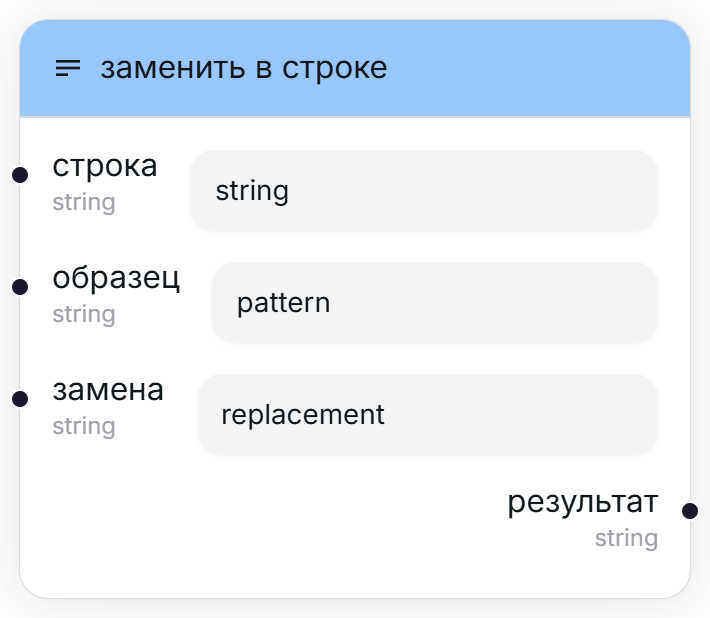
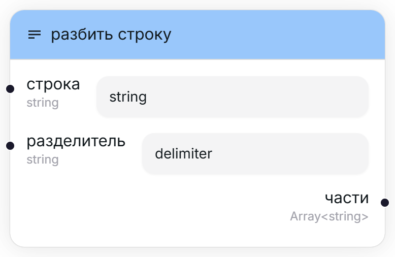
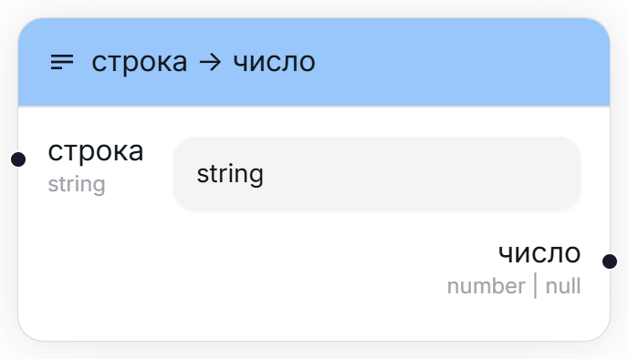
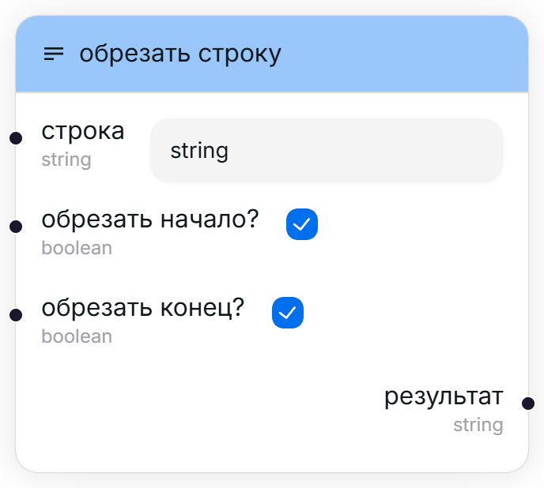

## Строка содержит X? [#contains]

<Wrapper>
    
</Wrapper>

Возвращает флаг, указывающий, содержит ли строка некую подстроку.

<TypeTable type={{
    "строка": {
        required: true,
        type: "string",
        io: "input",
    },
    "образец": {
        required: true,
        type: "string",
        io: "input",
        description: "Подстрока, которую стоит искать в оригинальной строке."
    },
    "результат": {
        required: true,
        type: "boolean",
        description: "Флаг, указывающий, содержит ли строка данный образец (подстроку)",
        io: "output"
    }
}}/>
## Заполнить строку по шаблону [#format]

<Wrapper>
    
</Wrapper>

Форматирует строку по заданному шаблону. Шаблон может содержать переменные, определённые через заполнители (`{индекс}`), которые позже заменяются переданными аргументами.

<TypeTable type={{
    "шаблон": {
        required: true,
        type: "string",
        io: "input",
        description: "Шаблон, по которому будет форматироваться строка."
    },
    "аргументы": {
        required: true,
        type: "Array<string | number | boolean>",
        typeDescription: "Массив из любых встроенных типов.",
        io: "input",
        description: "Аргументы, которыми будут заменяться заполнители. Обратите внимание, что порядок, в котором располагаются данные в массиве, очень важен."
    },
    "результат": {
        required: true,
        type: "string",
        description: "Отформатированная строка.",
        io: "output"
    }
}}/>

## Объединить строки [#join]

<Wrapper>
    
</Wrapper>

Объединяет несколько строк, между которыми ставится некий разделитель.

<TypeTable type={{
    "строки": {
        required: true,
        type: "Array<string>",
        typeDescription: "Набор строк.",
        io: "input",
        description: "Строки, которые необходимо соединить между собой в одну."
    },
    "разделитель": {
        type: "string",
        io: "input",
        description: "Строка, которая будет вставлена между каждыми двумя строками из массива.",
        default: "\"\" (пустая строка)"
    },
    "результат": {
        required: true,
        type: "string",
        description: "Новая строка, состоящая из объединённых строк из массива.",
        io: "output"
    }
}}/>

## Длина строки [#length]

<Wrapper>
    
</Wrapper>

Возвращает длину строки.

<TypeTable type={{
    "строка": {
        required: true,
        type: "string",
        io: "input",
    },
    "результат": {
        required: true,
        type: "number",
        description: "Длина строки.",
        io: "output"
    }
}}/>

<Callout type="warning">
    Из-за того, как устроен движок impoexpo, некоторые символы будут на самом деле засчитываться как два или больше. 
    Например, длина строки "💔" равна двум, хотя эмодзи вроде бы один. 
    Это связано с кодировкой Unicode. Возможно, мы добавим флаг для переключения алгоритма подсчёта :)
</Callout>

## Число -> строка [#number-to-string]

<Wrapper>
    
</Wrapper>

Преобразовывает число в строку.

<TypeTable type={{
    "число": {
        required: true,
        type: "number",
        io: "input",
        default: "0"
    },
    "строка": {
        required: true,
        type: "string",
        description: "Число, но уже в виде строки.",
        io: "output"
    }
}}/>

## Заменить в строке [#replace]

<Wrapper>
    
</Wrapper>

Заменяет в строке одну подстроку другой.

<TypeTable type={{
    "строка": {
        required: true,
        type: "string",
        io: "input",
    },
    "образец": {
        required: true,
        type: "string",
        io: "input",
        description: "Подстрока, которую стоит искать в оригинальной строке."
    },
    "замена": {
        required: true,
        type: "string",
        io: "input",
        description: "Строка, которой стоит заменить образец."
    },
    "результат": {
        required: true,
        type: "boolean",
        description: "Новая строка с заменёнными образцами (подстроками).",
        io: "output"
    }
}}/>

## Разбить строку [#split-string]

<Wrapper>
    
</Wrapper>

Разбивает строку по заданному разделителю на несколько строк.

<TypeTable type={{
    "строка": {
        required: true,
        type: "string",
        io: "input",
    },
    "разделитель": {
        required: true,
        type: "string",
        io: "input",
        description: "Подстрока, служащая как разделитель между строками."
    },
    "результат": {
        required: true,
        type: "Array<string>",
        typeDescription: "Набор строк.",
        description: "Массив с разделёнными строками.",
        io: "output"
    }
}}/>

## Строка -> число [#string-to-number]

<Wrapper>
    
</Wrapper>

Преобразовывает строку в число (если это возможно).

<Callout>
    Любое число можно преобразовать в строку, но не каждую строку можно преобразовать в число. 
    Если формат строки был неверен, например "hello", то данный узел вернёт null (отсутствие значения). Данную крайность можно обработать при помощи узла ["выдать ошибку если null"](/user/nodes/conditional#throw-error-if-null).
</Callout>

<TypeTable type={{
    "строка": {
        required: true,
        type: "string",
        io: "input",
    },
    "число": {
        required: true,
        type: "number | null",
        typeDescription: "Число (возможно)",
        io: "output"
    }
}}/>

## Обрезать строку [#trim-string]

<Wrapper>
    
</Wrapper>

Обрезает лишние пробелы с начала и/или конца строки.

<TypeTable type={{
    "строка": {
        required: true,
        type: "string",
        io: "input",
    },
    "обрезать начало?": {
        required: true,
        type: "boolean",
        io: "input",
        default: "истина (true)",
    },
    "обрезать конец?": {
        required: true,
        type: "boolean",
        io: "input",
        default: "истина (true)",
    },
    "результат": {
        required: true,
        type: "string",
        description: "Новая строка с обрезанными пробелами.",
        io: "output"
    }
}}/>